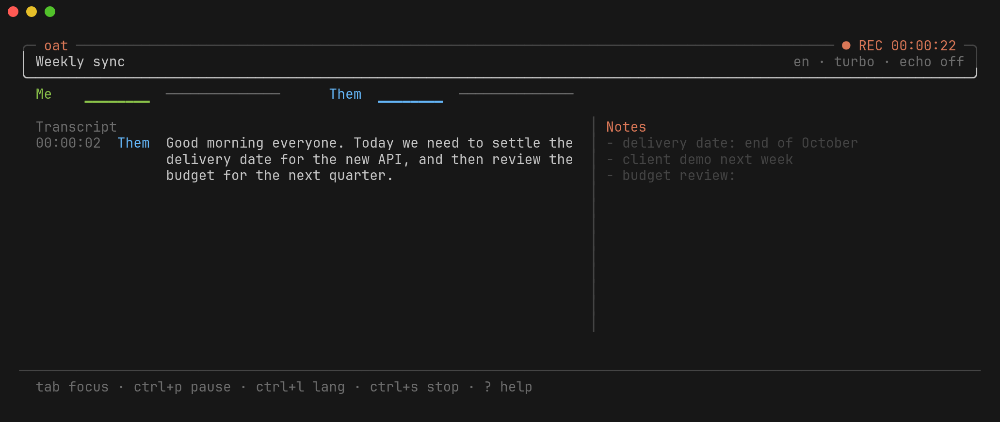

# oat

<p align="center">
  
</p>

oat records meetings on Linux from the terminal. It captures your microphone and the system audio as two separate streams, sends them to the Groq Whisper API, and saves the transcript next to the notes you type during the meeting. It also runs an MCP server, so Claude Code (or any other MCP client) can read your meetings and turn your rough notes into a summary.

This is an early version. It runs on Linux only and was tested on Pop!_OS 22.04 with PipeWire.

## How it works

`oat new "Title"` starts a recording. Two `parec` processes capture the mic ("Me") and the monitor of your default output ("Them"). The two streams never mix, so the transcript knows who said what.

Each stream is cut at pauses into chunks of 10 to 30 seconds and uploaded to Groq (`whisper-large-v3-turbo`). Chunks without speech are not sent. A line shows up in the transcript about 10 to 30 seconds after it was said, because Groq offers a file API and not a streaming one.

While the meeting runs you type notes in the right pane. Notes are saved 2 seconds after you stop typing, and each audio chunk is written to disk as soon as it is cut, so a crash loses the audio still in memory (under 30 seconds) and nothing else.

`oat mcp` gives an MCP client access to the meetings. In Claude Code, `/mcp__oat__enhance` asks Claude to merge your notes with the transcript, in the style of Granola, and save the result as `summary.md`.

Audio chunks go to Groq and are deleted once they are transcribed (set `keep_audio = true` to keep them). Transcripts, notes, and summaries stay on your disk.

## Requirements

- Linux with PipeWire (and its Pulse layer) or PulseAudio
- `parec` and `pactl`, from the `pulseaudio-utils` package
- Go 1.25 or later to build. Go 1.24 downloads 1.25 on its own.
- A Groq API key

## Install

Give oat your Groq key in one of two ways. Export it in your shell:

```sh
export GROQ_API_KEY=gsk_...
```

Or put it in `~/.config/oat/config.toml` and keep the file readable by you only:

```toml
groq_api_key = "gsk_..."
```

```sh
chmod 600 ~/.config/oat/config.toml
```

Then build and install:

```sh
git clone https://github.com/matheuscamposmt/oat
cd oat
make install
oat doctor
```

`make install` builds a static binary into `~/.local/bin/oat` and runs `oat setup`, which registers the MCP server in Claude Code at user scope. `oat doctor` checks the audio stack, the key, the MCP registration, and the data folder, and prints a fix under anything that fails.

`go install github.com/matheuscamposmt/oat/cmd/oat@latest` also works. Run `oat setup` yourself afterwards. With that install, `oat version` prints `dev`.

## Record a meeting

```sh
oat new "Weekly sync"             # Portuguese by default
oat new "Weekly sync" --lang en
oat                               # the list of past meetings; press n to start one
```

The notes pane has the focus when the recording starts, so you can type right away.

| Key | Action |
|---|---|
| `tab` | Move the focus between the transcript and the notes |
| `ctrl+p` | Pause or resume |
| `ctrl+l` | Change the language for the next chunks: `pt`, `en`, `auto` |
| `ctrl+s` | Stop and save |
| `ctrl+c` | Stop and save, after a yes/no question |
| `?` | Show the keys (in the transcript pane) |

After you stop, oat uploads the last chunks. If you quit before that is done, the next start of oat finishes it.

## Ask Claude about your meetings

In Claude Code, ask something like "what did they say about the budget in the last meeting?". Claude has these tools:

| Tool | Purpose |
|---|---|
| `list_meetings` | Lists the meetings, newest first |
| `get_meeting` | Reads the notes, the summary, and the transcript. The ID `live` reads the recording in progress |
| `search_meetings` | Finds text in all transcripts and notes |
| `save_summary` | Saves meeting notes as `summary.md` |

To get the summary, run `/mcp__oat__enhance`. Any other MCP client that can start a stdio server can use `oat mcp` the same way.

## Echo

With speakers, the microphone also hears the other people, so their words show up twice. oat handles this in two layers.

The first is the PipeWire echo-cancel module. In the default `auto` mode, oat loads it for every output except headphones. While oat records, your default output is `oat_ec_sink`. oat restores the old output when you stop. If oat crashes, the next start (or `oat doctor`) removes the module.

The second is a text filter that drops a "Me" line when it repeats a "Them" line from the same seconds.

## Configuration

`~/.config/oat/config.toml` is optional. These are the keys and their defaults:

```toml
lang = "pt"                        # ISO 639-1 code, or "auto"
model = "whisper-large-v3-turbo"   # or "whisper-large-v3"
echo = "auto"                      # auto, on, off
keep_audio = false                 # keep the WAV chunks in audio/
groq_api_key = ""                  # used when GROQ_API_KEY is not set
```

The flags `--lang`, `--model`, `--echo`, and `--keep-audio` override the file.

## Files

Each meeting is a folder in `~/.local/share/oat/meetings/`:

| File | Content |
|---|---|
| `meta.json` | Title, start, end, language, model, status |
| `transcript.jsonl` | One raw segment per line |
| `transcript.md` | The readable transcript |
| `notes.md` | Your notes |
| `summary.md` | The notes Claude wrote |
| `chunks/` | Audio waiting for Groq |
| `failed/` | Audio that Groq refused |
| `audio/` | Audio kept with `keep_audio = true` |
| `.lock` | The PID of the process that is recording |

## Groq limits

The Groq free tier caps the audio seconds per hour. Two streams can send up to twice the length of the meeting, which is why oat skips chunks with less than a second of speech. When Groq rate-limits a request, the HUD shows how long it waits.

## License

MIT. See `LICENSE`.
